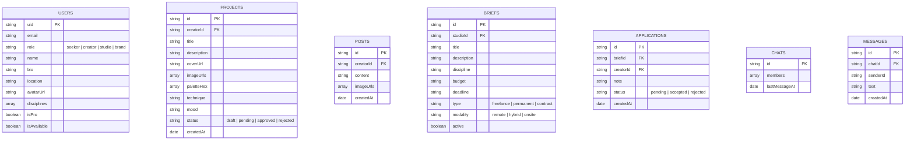
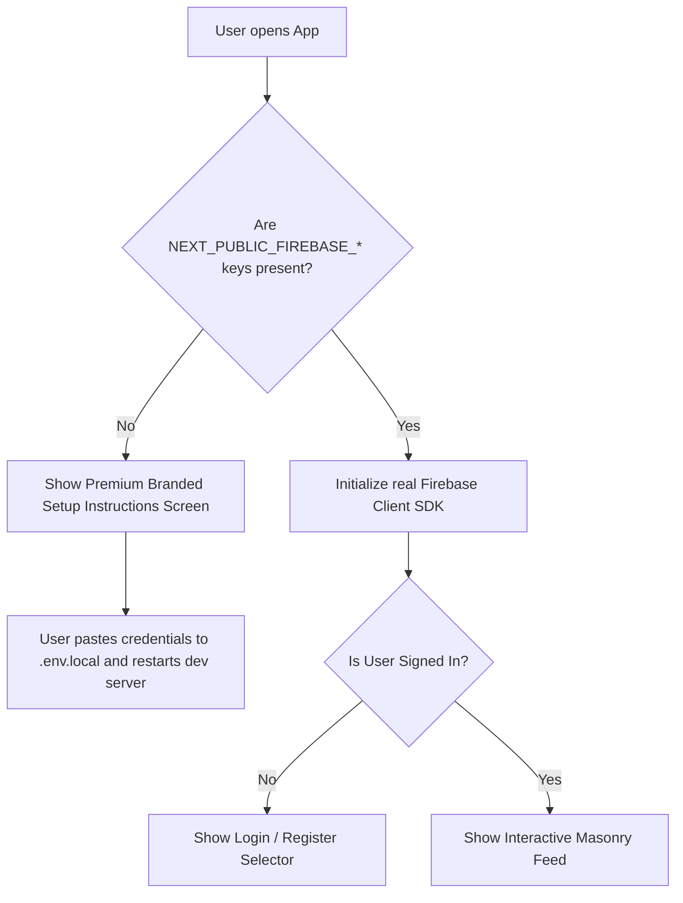

# Technical Specification: BareFolio High-Fidelity Prototype (iOS & Web)

This technical specification details the architecture, design tokens, database modeling, and interactive routing for the high-fidelity prototype of **BareFolio**. The goal is to build a pixel-perfect, interactive demonstration for investors and users, designed to run natively on iOS (via Capacitor.js) and as a responsive WebApp.

---

## 1. Project Parameters & Strategy

Following the `/grill-me` requirement analysis, the prototype will be constructed on the following foundations:

1. **Target Platforms**: 100% focused on **iOS** (packaged with Capacitor.js) and a **responsive WebApp** deployed on Vercel. (Android is out of scope).
2. **Authentication & Access**: Strict login and registration are required. If Firebase environment variables are missing, the user is greeted with a gorgeous, branded onboarding configuration page detailing how to configure their `.env.local` keys.
3. **Database Architecture**: Real-time client-side integrations with **Firebase client SDK**. Firestore will store all production-ready collections, and Firebase Storage will hold asset uploads. We will use client-side reactive bindings (`onSnapshot`, `addDoc`, etc.) to support a static output export (`output: 'export'`) required by Capacitor.
4. **Visual Style**: Minimalist Premium (Apple Style + Glassmorphism).
   - Large rounded borders (`rounded-2xl` to `rounded-3xl`).
   - Traslucent visual components utilizing `backdrop-filter: blur()`.
   - Sleek dark and light mode adaptation.
5. **Typography System**: Custom fonts:
   - **Switzer** (from Fontshare CDN): Elegant display typeface for headings, titles, logo elements, and project cards.
   - **Geist** (from Google Fonts API): Clean, highly-precise UI typeface for body text, navigation tabs, buttons, and metadata.

---

## 2. Navigation & Interface Architecture

The interface follows the spec's 5-tab bottom navigation structure for iOS and responsive sidebar navigation for desktop screens.

```
🏠 Home / Feed           🔍 Explore                ＋ Crear (Modal)          ✉ Inbox                   ◯ Perfil
  ├── For You              ├── Grid (Filters)        ├── Nuevo Proyecto        ├── Chats DMs             ├── Datos de Cuenta
  └── Following            ├── Swipe (Tinder-style)  ├── Nuevo Post            ├── Aplicaciones Briefs   ├── Proyectos Aprobados
                           └── Find Talent (Scout)   └── Nuevo Brief (Scout)   ├── Chats Comunidad       ├── Posts Publicados
                                                                               └── Notificaciones        └── Colecciones Públicas
```

### Route & Component Mapping (`src/app/`)

- `/` (Home/Feed View): Contains the toggle between "For You" (curated discovery) and "Following" (chronological verified creators). Displays the Pinterest-style masonry grid.
- `/explore`: The search and discovery hub. Features a top segmented sub-tab control:
  - **Grid View**: Search with active visual filters (Discipline, Technique, Palette Hex, Mood, Location, Availability).
  - **Swipe View**: Tinder-style gesture-based discover mode. Swiping left (skip) or right (save/match) adjusts preference vectors in real time.
  - **Find Talent View**: Specialized creative directory (visible only to Studio and Brand Scout accounts).
- `/inbox`: Unified communications hub containing:
  - DMs: One-to-one messaging thread.
  - Brief Applications: Scout users tracking applications, Creator users tracking submissions.
  - Communities: Closed server channels.
  - Notifications: Chronological account updates.
- `/profile/[id]`: Multi-tab user portfolios:
  - Creator: Projects grid, Posts timeline, and Public Inspiration folders.
  - Studio: Team projects, Posts, Active briefs, and Member roster.
  - Brand: Active briefs and Member roster.
- `/onboarding`: Branded gateway selector. Selecting Seeker, Creator, Studio, or Brand opens the custom registration forms.

---

## 3. Database Modeling (Firestore)

All interactions are bound in real time to Firestore collections. Here is the strict database schema:



---

## 4. Design System Tokens (Tailwind Configuration)

### Fonts CDN & Styles Configuration (`src/app/globals.css`)
```css
@import url('https://api.fontshare.com/v2/css?f[]=switzer@100,200,300,400,500,600,700,800,900&display=swap');
@import url('https://fonts.googleapis.com/css2?family=Geist:wght@100..900&family=Geist+Mono:wght@100..900&display=swap');

:root {
  --font-display: 'Switzer', -apple-system, sans-serif;
  --font-sans: 'Geist', system-ui, sans-serif;
  
  /* Apple Glassmorphism Light Tokens */
  --bg-primary: rgba(245, 245, 247, 0.8);
  --bg-card: rgba(255, 255, 255, 0.7);
  --blur-amount: 20px;
  --border-glass: rgba(0, 0, 0, 0.08);
  --accent: #0071e3;
  --accent-foreground: #ffffff;
}

@media (prefers-color-scheme: dark) {
  :root {
    /* Apple Glassmorphism Dark Tokens */
    --bg-primary: rgba(29, 29, 31, 0.85);
    --bg-card: rgba(45, 45, 47, 0.75);
    --border-glass: rgba(255, 255, 255, 0.08);
    --accent: #0a84ff;
  }
}
```

---

## 5. Security & Access Gate Configuration

If Firebase credentials are not supplied in `.env.local`, a high-fidelity onboarding gateway will prevent database access exceptions.

### Setup Check Flow Diagram


---

## 6. Verification & Implementation Roadmap

We will divide the build phase into systematic, testable blocks:

*   **Phase 1**: Typography, Tailwind CSS tokens setup, and Firebase configuration verification with the Gatekeeper Setup Screen.
*   **Phase 2**: Onboarding & Authentication flow (card-based role selector, registration form, login page connected to real Firebase Auth & Firestore user records).
*   **Phase 3**: Core Shell Shell layout (traslucent floating bottom Tab Bar for iOS, safe area limits, desktop sidebar transition).
*   **Phase 4**: Masonry Feed, Explore (Grid, Tinder-style Swipe visual, and Find Talent toggles) utilizing direct real-time Firestore reads.
*   **Phase 5**: Submissions (Create Modal adding projects/posts to Firestore), Inbox (DMs and briefs applications tracker), and Profile screens.
*   **Phase 6**: Verification and Capacitor builds sync for Simulator/Device check.

---

## 7. Automated Verification Commands

- `npm run build`: Static compilation check. Exports the site to the `out/` directory.
- `npx cap sync`: Capacitor synchronization test. Ensures static web assets translate smoothly into native iOS folder dependencies.
