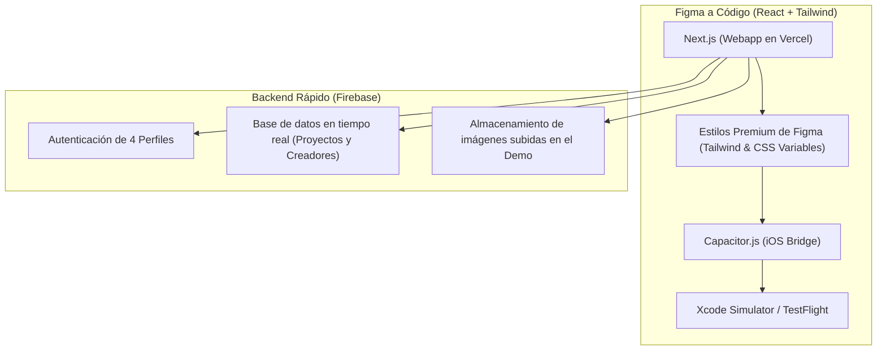

# Plan de Prototipado Rápido: Plataforma de Creativos (iOS & Web)

Esta guía técnica está diseñada para llevar tus diseños de Figma al código de la forma más rápida y fiel posible, con el objetivo de construir un **prototipo funcional de alta fidelidad** listo para mostrar a inversores y realizar pruebas con usuarios reales en **iOS (App Store/TestFlight)** y **Web**.

---

## 1. Arquitectura del Prototipo (iOS + Web)

Para lograr la fidelidad exacta de Figma en un tiempo récord y con la capacidad de probar en teléfonos reales, mantendremos el enfoque **Next.js + Capacitor.js (enfocado 100% en iOS)**.



### Ventajas para la Demo de Inversores:
*   **Velocidad de cambio**: Si un inversor o tester te da feedback sobre el diseño, cambias el código CSS/Tailwind una vez y se actualiza instantáneamente tanto en la webapp como en la app de iOS.
*   **Fidelidad de Figma**: Next.js y Tailwind CSS permiten implementar degradados complejos, efectos de desenfoque de fondo (*backdrop-filter / glassmorphism*), sombras personalizadas y animaciones fluidas con precisión de pixel, algo que en plataformas como React Native puro puede ser tedioso de replicar de forma idéntica al diseño web de Figma.
*   **Despliegue inmediato**: Puedes enviar un enlace de **Vercel** por WhatsApp para que lo prueben en el navegador móvil en 5 segundos, y usar **TestFlight** para aquellos que quieran instalar la app nativa en su iPhone.

---

## 2. Estrategia de Figma a Código Premium

Para que el prototipo se sienta "real" y costoso:
1. **Sistema de Diseño Unificado**: Extrae tus variables de Figma (Colores HSL, tipografías de Google Fonts como Inter/Outfit, y espaciados) y colócalas en tu archivo `tailwind.config.js` y `globals.css`.
2. **Layout Pinterest (Masonry)**:
   Usa un layout dinámico responsivo. En iOS (pantalla vertical) se verá en 2 columnas, mientras que en la versión de escritorio de la webapp se expandirá elegantemente a 4 o 5 columnas.
3. **Micro-interacciones**:
   Añade efectos táctiles en iOS (escalado suave al presionar botones, transiciones de páginas usando *View Transitions API* o Framer Motion para que se sienta nativo y premium).

---

## 3. Hoja de Ruta para el Prototipo (Inversores y Testers)

Este es el plan de ejecución simplificado que podemos arrancar hoy mismo:

### Paso 1: Inicialización y Setup de iOS (Hoy)
1. Crearemos el proyecto Next.js limpio.
2. Agregaremos Capacitor y la plataforma de iOS:
   ```bash
   npm install @capacitor/core @capacitor/cli
   npx cap init "Creativos" "com.creativos.app" --web-dir=out
   npm install @capacitor/ios
   npx cap add ios
   ```

### Paso 2: Modelo de Datos para Demo
Configuraremos Firebase con datos de prueba atractivos (imágenes reales de alta calidad y descripciones de proyectos creativos) divididos en los **4 perfiles** para que, cuando el inversor abra la app por primera vez, el feed de inspiración esté lleno y sea interactivo.

### Paso 3: Onboarding y Registro de Perfiles
Programaremos la pantalla de registro donde el usuario selecciona visualmente uno de los 4 tipos de perfil creativos con tarjetas interactivas animadas.

### Paso 4: Despliegue y Distribución
1. **Webapp (Vercel)**: Configuración de CI/CD para que cada cambio de código se suba a una URL pública en segundos.
2. **iOS (Xcode / TestFlight)**:
   Abrir Xcode (`npx cap open ios`), configurar el perfil de desarrollador y generar una build para subir a **Apple TestFlight** para invitar a tus primeros testers usando su correo electrónico.
